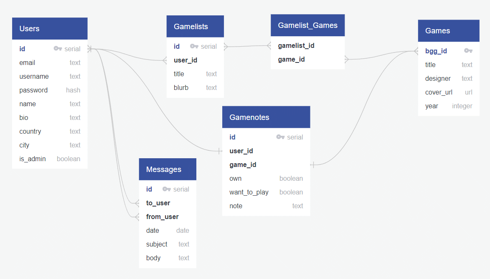

# Board Game Library and Player Finder

## 1. What tech stack will you use for your final project?

React and Redux for the front-end. Node, Express and Postgres for the back-end.

## 2. Is the front-end UI or the back-end going to be the focus of your project? Or are you going to make an evenly focused full-stack application?

I will be creating a full-stack application with a focus on the UI.

## 3. Will this be a website? A mobile app? Something else?

This will be a website, though I will ensure the UI is responsive and works well on mobile.

## 4. What goal will your project be designed to achieve?

The goal will be to allow users to organize their game collection and find players nearby who are interested in playing specific games.

## 5. What kind of users will visit your app? In other words, what is the demographic of your users?

The users will be people who are interested in hobby board games and are looking to organize their collections as well as search for people to play games with.

## 6. What data do you plan on using? How are you planning on collecting your data?

I will be using the [Board Game Atlas API](https://api.boardgameatlas.com/api/docs) to collect board games data. Users will search for games to add to their libraries and mark games they are interested in playing with others.

## 7. In brief, outline your approach to creating your project (knowing that you may not know everything in advance and that these details might change later). Answer questions like the ones below, but feel free to add more information:

### a. What does your database schema look like?

<!-- via [quickdatabasediagrams.com](quickdatabasediagrams.com) -->

### b. What kinds of issues might you run into with your API? This is especially important if you are creating your own API, web scraping produces notoriously messy data.

The Board Game Atlas API may be missing some games, though it is quite complete. It allows for multiple types of searching, which may complicate the search UI.

### c. Is there any sensitive information you need to secure?

User location data may need to be secured.

### d. What functionality will your app include?

Users will:
- Search for board games
- Add board games to their library or “Want to Play” list
- Users can search for local players who are interested in a specific game
- Users can make themselves available to be found for games

### e. What will the user flow look like?

1. Create an Account or Sign In
2. Search for Board Games
3. Add Board Games to collections
4. Mark Board Games they wish to play
5. Search for users in city who are looking to play games
6. Message users who they want to play with

### f. What features make your site more than a CRUD app? What are your stretch goals?

Allowing users to connect with players in their area is what makes this more than CRUD.

Stretch goals include things like:
- Scheduling a time to play a game
- Forming groups for ongoing play
- Linking the user to Amazon to purchase games
- Integrating with BoardGameGeek for reviews and more game information.
